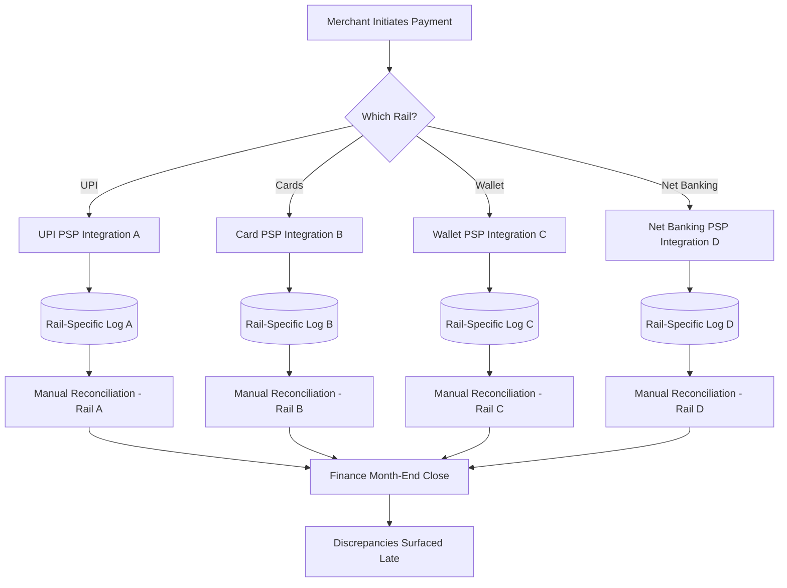

# As-Is Business Architecture

## Narrative

Paivo's payment execution business process today is organized around the rail, not the merchant or the transaction. When a merchant wants to accept a new payment method — say, a specific wallet provider — Paivo's integration team scopes and builds a dedicated point-to-point connection to that wallet's PSP: authentication, request/response mapping, webhook handling, and a bespoke reconciliation job that pulls the PSP's settlement file and matches it against Paivo's own transaction log for that rail only.

This produces a business process where **payment initiation, status tracking, and reconciliation all run as N parallel, independently-maintained pipelines** — one per rail/PSP combination — rather than as one process with N pluggable rail connections. Each pipeline has its own retry logic, its own idempotency handling (inconsistently implemented — some rails de-duplicate on merchant order ID, others do not de-duplicate at all and rely on manual finance review to catch double-charges), and its own settlement file format.

The reconciliation function sits organizationally in Finance Operations, not Engineering, and today consists of 4.5 FTEs who each own a subset of rails, manually cross-referencing PSP settlement files against Paivo's internal transaction records in spreadsheets and semi-automated scripts built incrementally over several years. There is no single "authoritative transaction record" — the closest approximation is the union of N rail-specific databases, and discrepancies between them are the norm, not the exception, discovered largely during month-end close.

Compliance reporting is similarly fragmented: because no shared message transformation capability exists, any regulator-mandated structured messaging format has historically been handled by asking each rail integration owner to add ad hoc formatting logic to their own pipeline — which is precisely the pattern that makes the ISO 20022 mandate untenable under the current model.

## As-Is Process Flow

## Key As-Is Characteristics

- **No shared idempotency guarantee.** Retry behavior on network failure or PSP timeout differs per rail integration, and at least two documented double-debit incidents in the past 18 months trace to inconsistent retry handling.
- **No single ledger of truth.** "The ledger" is a spreadsheet-mediated union of four+ independent data stores, refreshed and reconciled on a delay measured in days, not hours.
- **Compliance logic is duplicated and inconsistent.** Any regulatory formatting requirement must be implemented N times, by N different owners, with no shared test suite.
- **New rail onboarding is a full bespoke build.** There is no standard adapter contract; every integration re-solves authentication, retries, and reconciliation from scratch, which is the direct driver of the $180K average per-rail integration cost quantified in the business case.
- **Organizational ownership is fragmented by rail**, which means no single team or role has end-to-end visibility into a transaction's full lifecycle across initiation, settlement, and reconciliation.

---
*Fictional case study — see [README](../README.md) for full disclaimer.*
