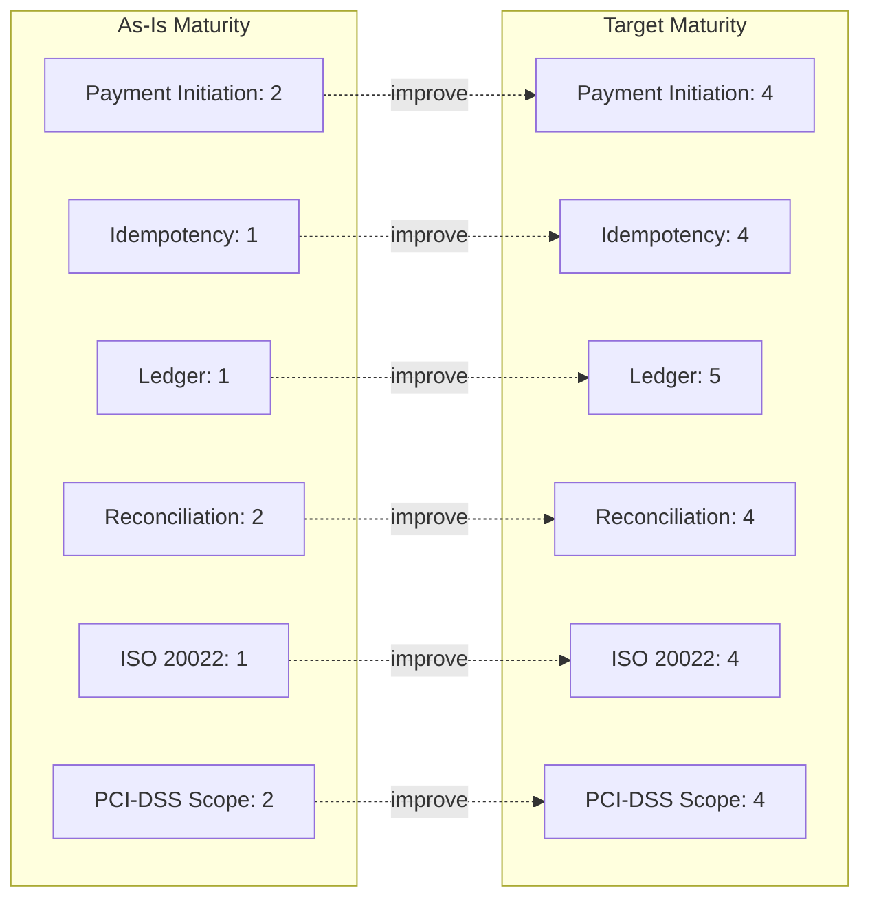

# Capability Map

## Purpose

This capability map inventories Paivo's payments-relevant business capabilities and rates their maturity on a 1-5 scale, as-is and target, using a standard capability maturity rubric: 1 = ad hoc/undocumented, 2 = repeatable but manual and inconsistent, 3 = defined and standardized, 4 = measured and managed, 5 = optimized and continuously improved. Ratings were assigned jointly by the ARB and the relevant capability owner during Phase B workshops.

## Capability Maturity Ratings

| Capability | As-Is Maturity | Target Maturity | Gap Driver |
|---|---|---|---|
| Payment Initiation & Routing | 2 | 4 | Routing logic duplicated per rail integration, no shared routing policy engine |
| Idempotency & Retry Management | 1 | 4 | Inconsistent per-rail implementation; no platform-enforced contract |
| Transaction Ledger Management | 1 | 5 | No single ledger exists today; target state makes this the platform's most-invested capability |
| Reconciliation & Settlement Matching | 2 | 4 | Manual, spreadsheet-mediated, rail-fragmented today |
| Regulatory Message Compliance (ISO 20022) | 1 | 4 | Does not exist today in structured form; built once, centrally, in target state |
| PCI-DSS Scope Management | 2 | 4 | Sensitive data handling scattered across 11 systems today vs. consolidated vault + adapters |
| Rail/PSP Partner Onboarding | 2 | 4 | Bespoke, undocumented process per integration today vs. defined adapter contract |
| Dispute & Chargeback Handling | 3 | 3 | Adequately mature today; not in program scope, held steady deliberately |
| Merchant Settlement Reporting | 2 | 4 | Currently assembled manually from fragmented sources; target state derives directly from ledger |
| Fraud & Risk Signals Integration | 2 | 3 | Modest improvement expected as a side effect of unified transaction visibility; not a primary program driver |
| Cross-Border Payment Processing | 1 | 1 (unchanged in this program) | Explicitly out of scope — see [`vision-and-scope.md`](../01-phase-a-vision-and-scope/vision-and-scope.md); target maturity for this capability is addressed in a future program |
| Merchant Onboarding & KYC | 3 | 3 | Out of scope for this program; held steady |

## Capability Heat Map (Illustrative)

## Reading This Map

Two capabilities are deliberately held flat rather than improved: **Cross-Border Payment Processing** and **Merchant Onboarding & KYC**, both explicitly excluded from program scope in Phase A. Including them in this program's maturity uplift would have diluted focus and schedule against the ISO 20022 deadline, which is the program's non-negotiable constraint. **Dispute & Chargeback Handling** is rated adequately mature already (3/5) and was deliberately not prioritized for uplift — its process sits downstream of the ledger and reconciliation improvements and is expected to benefit indirectly without direct investment.

The largest single maturity jump — **Transaction Ledger Management, 1 to 5** — reflects that this capability does not meaningfully exist today (fragmented rail-specific records are not a ledger) and is the capability the entire program is structurally organized around, per architecture principle 1.

---
*Fictional case study — see [README](../README.md) for full disclaimer.*
