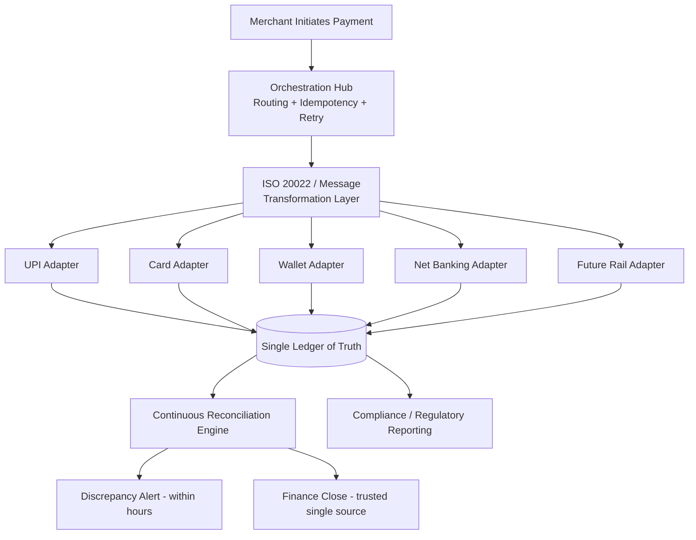

# To-Be Business Architecture

## Narrative

In the target state, payment initiation, status tracking, reconciliation, and compliance messaging are organized around **one orchestration process with pluggable rail adapters**, not N independent rail pipelines. A merchant's payment request enters the orchestration hub once; the hub determines routing (which rail, which PSP) and delegates protocol-specific work to the relevant adapter, but retry policy, idempotency enforcement, and the transaction's authoritative record all live in the shared orchestration core regardless of which rail was used.

Every transaction — irrespective of rail — is written once to the single ledger service as its terminal source of truth. Reconciliation becomes a single process that ingests settlement files from every rail adapter, normalizes them against a common schema, and matches them against the ledger, rather than four-plus independently-maintained reconciliation pipelines. This is the direct mechanism by which discrepancy detection moves from "surfaced in month-end close" to "surfaced within hours of settlement," because the matching logic runs continuously against one authoritative record instead of being manually assembled from fragments.

ISO 20022 (and any future structured-messaging requirement) is handled by the shared transformation layer sitting between the adapters and the orchestration core: it converts the canonical internal transaction representation to and from whatever wire format a rail or regulator requires, in one place, tested once. Bringing a new rail online becomes: build an adapter that speaks the rail's native protocol and emits the canonical internal event — the orchestration core, ledger, reconciliation, and compliance messaging require no rail-specific changes.

Organizationally, this shifts reconciliation from a Finance Operations function assembling data from Engineering-owned silos, to a shared responsibility where Finance Operations consumes a single, trustworthy ledger view and Engineering owns the platform that guarantees its accuracy — a genuine handoff of the fragmented-data burden rather than a relabeling of the same manual process.

## To-Be Process Flow

## Key To-Be Characteristics

- **One idempotency and retry contract, enforced by the platform**, applied uniformly regardless of rail (see [ADR-004](../adrs/adr-004-idempotency-retry-strategy.md)).
- **One ledger of truth**, written to synchronously by every adapter before a transaction is considered orchestrated (architecture principle 1).
- **One compliance transformation layer**, meaning a future regulatory format change is a bounded, centrally-owned change, not an N-integration retrofit.
- **New rail onboarding follows a defined adapter contract**, cutting projected onboarding cost from ~$180K to ~$45K per rail (illustrative, per [`business-case.md`](../01-phase-a-vision-and-scope/business-case.md)).
- **Reconciliation shifts from manual, delayed, and rail-fragmented to continuous, automated, and unified**, directly targeting the discrepancy-detection metric in [`vision-and-scope.md`](../01-phase-a-vision-and-scope/vision-and-scope.md).
- **PCI-DSS-relevant data handling consolidates** into the adapters and vault boundary rather than being scattered across N independent integrations, materially shrinking audit scope.

This target state is not reached in one step — see [`06-phase-f-migration-planning/transition-architectures.md`](../06-phase-f-migration-planning/transition-architectures.md) for the intermediate state Paivo operates in during migration, where some rails run through the hub and others remain point-to-point.

---
*Fictional case study — see [README](../README.md) for full disclaimer.*
