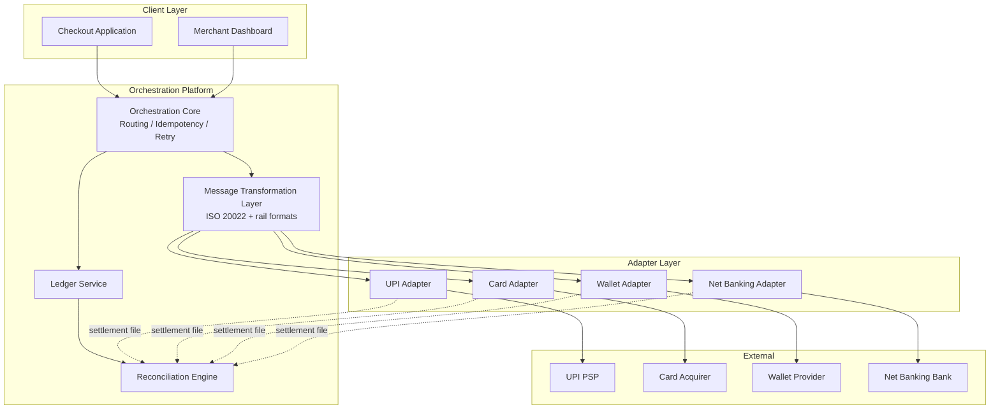

# Application Architecture

## As-Is Application Architecture

The as-is application landscape is a set of ~20 independently deployed integration services, each owning the full vertical stack for one rail/PSP combination: API client, authentication, request/response mapping, webhook receiver, local persistence, and a reconciliation batch job. There is no shared library or platform service between them beyond a common merchant-lookup API and a shared logging/monitoring baseline. Each integration service is typically owned by a small (2-3 engineer) team, and institutional knowledge of a given integration's quirks lives largely with that team, which has produced real bus-factor risk — two of the fourteen live integrations currently have a single engineer who understands their retry edge cases in depth.

Merchant-facing checkout and dashboard applications call into whichever integration service matches the merchant's selected rail directly, meaning the client-facing surface has direct knowledge of which backend service handles which rail — a coupling that also complicates adding new rails, since client applications need updates alongside backend integration work.

## To-Be Application Architecture

The target application architecture separates concerns into four layers, each independently deployable and independently scalable:

1. **Orchestration Core** — the single service (deployed active-active, multi-region, per architecture principle 8) that owns routing, idempotency enforcement, retry policy, and ledger writes. It exposes one stable API to all callers (merchant-facing checkout, merchant dashboard, internal services) regardless of which rail ultimately processes the payment.
2. **Message Transformation Layer** — sits between the orchestration core and adapters, converting the canonical internal schema to and from rail-native and regulatory (ISO 20022) formats. Deployed as a shared, versioned service rather than embedded logic in either the core or adapters (see [ADR-003](../adrs/adr-003-iso20022-transformation-layer-placement.md)).
3. **Rail Adapters** — one per rail/PSP, each a small, independently deployable service implementing a standard adapter interface (defined in [`05-phase-e-opportunities-and-solutions/solution-building-blocks.md`](../05-phase-e-opportunities-and-solutions/solution-building-blocks.md)). Adapters are the only layer permitted to contain rail-specific logic, per architecture principle 2.
4. **Ledger & Reconciliation Services** — the ledger service is the sole writer of authoritative transaction state; the reconciliation engine is a separate, read-only consumer of ledger and settlement data, kept structurally distinct so a bug in reconciliation logic can never corrupt ledger state.

Client-facing applications (checkout, merchant dashboard) call only the orchestration core's stable API — they have no knowledge of which adapter or rail ultimately handles a given payment, which decouples client release cycles from rail-onboarding work entirely.

## To-Be Application Architecture Diagram

## Integration Pattern Decision

The layer boundaries above were deliberately chosen over a simpler **"fat adapter"** pattern where each adapter embeds its own message transformation logic (including ISO 20022 formatting). The fat-adapter alternative was seriously considered because it would have let adapter teams move independently without a shared-layer dependency, shortening any single adapter's build time by an estimated 15-20%. It was rejected because it directly reproduces the point-to-point maintenance burden the program exists to eliminate: a future ISO 20022 revision, or a new regulatory message standard, would again require touching every adapter individually rather than one shared layer — see [ADR-003](../adrs/adr-003-iso20022-transformation-layer-placement.md) for the full trade-off analysis and the stakeholders who reviewed it.

A second alternative — embedding transformation logic inside the orchestration core itself rather than as a separate layer — was also rejected, because it would violate architecture principle 2 (rail-agnostic core) by coupling core release cycles to message-format changes that are, in practice, driven by external regulatory and PSP timelines outside Paivo's control.

---
*Fictional case study — see [README](../README.md) for full disclaimer.*
