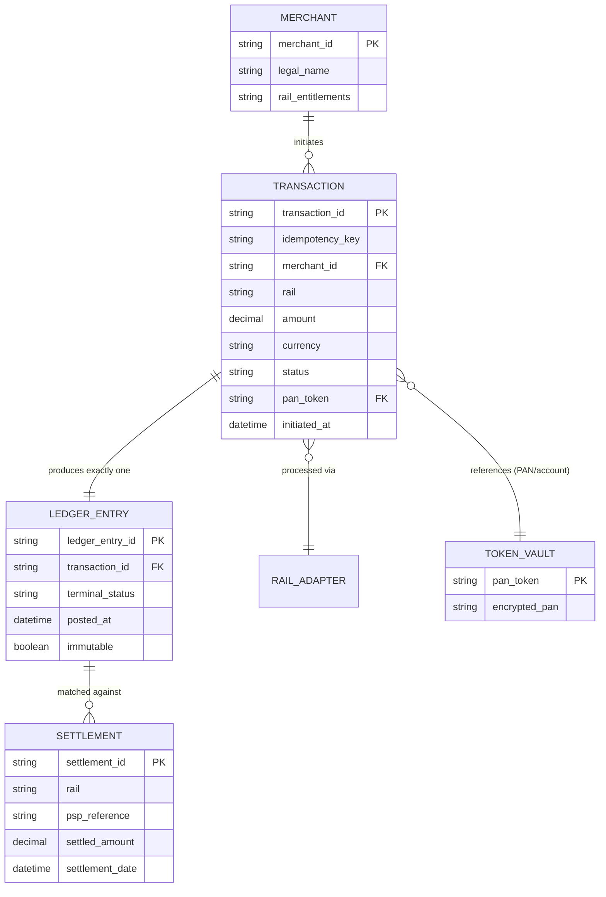

# Data Architecture

## As-Is Data Architecture

Data today is organized by rail integration, not by business entity. Each of the ~20 point-to-point integrations owns its own transaction table, its own copy of relevant merchant configuration, and its own settlement/reconciliation working store — typically a mix of relational tables and CSV settlement files parsed into spreadsheets. There is no canonical definition of a "transaction" that holds across rails: field names, status enumerations, and even currency/amount representations differ integration to integration, because each was built independently by a different team at a different time against a different PSP's API shape.

This produces four recurring data problems the target architecture is designed to eliminate:

1. **No canonical transaction entity.** The same real-world payment event is represented differently depending on which rail processed it, which makes cross-rail reporting and reconciliation require bespoke mapping work every time.
2. **No single settlement/ledger record.** "Settled" is a status tracked independently per rail integration, with no aggregation point, which is the direct cause of the fragmented reconciliation problem described in Phase B.
3. **Sensitive data sprawl.** Raw PAN and account data is persisted in multiple integration-specific stores because there was never a mandate to centralize or tokenize it, which is the direct driver of Paivo's current 11-system PCI-DSS audit scope.
4. **No merchant-rail-agnostic settlement history.** Merchants requesting a consolidated settlement report today require manual assembly across rail-specific stores by Finance Operations.

## To-Be Data Architecture

The target state establishes four canonical data domains, owned centrally by the orchestration platform and consumed (not duplicated) by every other system:

- **Transaction** — the canonical representation of a single payment event: amount, currency, merchant, rail, status, timestamps, idempotency key. Adapters translate rail-native representations into this canonical schema at ingestion; nothing downstream of the orchestration core ever sees rail-native transaction formats.
- **Ledger Entry** — the immutable, append-only record written once a transaction reaches a terminal orchestration state. This is the single ledger of truth (architecture principle 1) and the authoritative source for reconciliation and financial reporting.
- **Merchant** — merchant identity, configuration, and rail entitlements, referenced by the orchestration core but not owned by it (KYC/onboarding remains out of scope, per Phase A).
- **Settlement** — the normalized representation of PSP settlement files, ingested by the reconciliation engine and matched against Ledger Entry records to produce discrepancy signals.

Sensitive cardholder and account data is tokenized at the adapter boundary (architecture principle 5) — the canonical Transaction entity carries tokens, never raw PAN, and only the PCI-scoped vault service can resolve a token back to raw data, and only for the narrow set of operations (e.g., dispute evidence, regulator request) that require it.

## Data Domain Relationship

## Integration Pattern

Data moves from adapters into the canonical domains via an **event-driven publish pattern**: each adapter publishes a normalized transaction event to the orchestration core, which is the only writer to the Ledger Entry domain. This was chosen over a **shared-database pattern** (adapters writing directly to a common transaction table) because a shared-database pattern was assessed to violate architecture principle 2 (rail-agnostic core) — it would let adapter-specific write patterns and schema assumptions leak into the core's data model over time, reproducing exactly the coupling problem the program exists to remove. It was also rejected because it makes independent adapter deployment unsafe: a schema change needed by one adapter could break another adapter's writes to the same table.

The reconciliation engine consumes both the Ledger Entry stream and the Settlement stream as independent inputs and performs matching as a downstream, read-only process — it never writes back into either domain, preserving Ledger Entry's immutability guarantee (architecture principle 1).

---
*Fictional case study — see [README](../README.md) for full disclaimer.*
