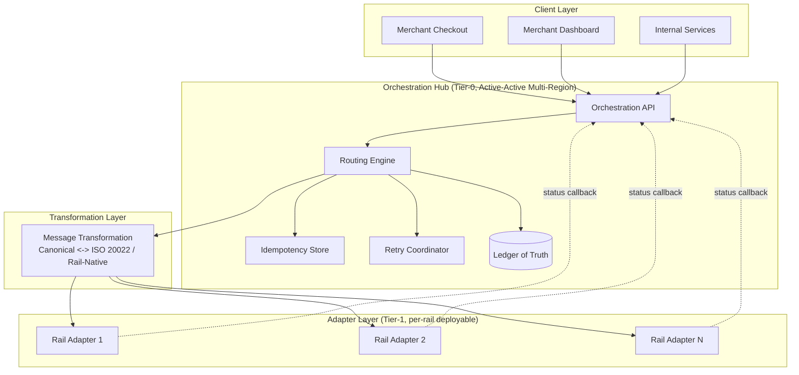

# Reference Architecture: Central Payment Orchestration Hub

## Overview

This is Paivo's approved reference architecture for payment orchestration: a central hub owning routing, idempotency, and ledger writes, with rail-specific protocol handling isolated to independently deployable adapters, and a shared message transformation layer for canonical-to-wire-format conversion (including ISO 20022). This pattern is the foundation for every solution building block described in [`05-phase-e-opportunities-and-solutions/solution-building-blocks.md`](../05-phase-e-opportunities-and-solutions/solution-building-blocks.md).

## Pattern Diagram

## Applicability Conditions

This pattern applies when:

- Multiple external payment rails or PSPs must be integrated behind a consistent internal contract.
- A single authoritative transaction/settlement record is a business requirement (regulatory, financial reporting, or reconciliation-driven).
- New rail/PSP integrations are expected on an ongoing basis, not a one-time, fixed, small set that will never grow.
- Message format compliance (e.g., ISO 20022) needs to be centrally auditable rather than independently implemented per integration.
- The organization can support operating a Tier-0, high-availability shared service — this pattern concentrates criticality into the hub, which requires investment (active-active multi-region deployment, on-call maturity) to avoid becoming a fragile single point of failure.

## When NOT to Use This Pattern

This pattern is not universally correct, and the ARB explicitly documented the conditions under which a different topology should be chosen instead, to prevent this reference architecture from being cargo-culted onto problems it doesn't fit:

- **A small, fixed number of integrations with no growth expectation.** If an organization genuinely has (and will always have) two or three payment integrations with no roadmap to add more, a central orchestration hub adds coordination overhead — versioning the adapter contract, operating a Tier-0 shared service — that a simpler direct-integration or even point-to-point model may not need to justify. The hub's value comes from amortizing cost across many integrations; with few integrations, that amortization never pays back the platform investment. Paivo's own situation (14 live rails, 6/year growth, regulatory mandate) clears this bar comfortably, but a smaller payments operation should re-evaluate.
- **Extremely latency-sensitive, single-rail-only use cases.** Where a system talks to exactly one payment rail and sub-millisecond routing decisions matter more than multi-rail flexibility, the extra hop through a generic orchestration and transformation layer is pure overhead. A direct, optimized single-rail integration will outperform a general-purpose hub for that narrow case.
- **Organizations without the operational maturity to run a Tier-0 shared service.** This pattern concentrates business-critical logic into the hub. An organization that cannot commit to multi-region active-active deployment, robust on-call, and rigorous idempotency testing will turn the hub into a worse single point of failure than the fragmented model it replaced — the fragmented model at least fails independently, rail by rail, rather than fails together.
- **When adapters would need fundamentally incompatible transaction semantics.** If some future "rail" is not actually a payment rail in the same sense (e.g., a completely different settlement model with no reasonable mapping to the canonical transaction schema), forcing it through this pattern's adapter contract produces a leaky, distorted adapter rather than a clean one. In that case, a separate bounded context — not a shoehorned adapter — is the right call, and the ARB should be consulted before extending the canonical schema to accommodate it.
- **Early-stage / pre-product-market-fit companies.** Building this reference architecture before there is validated need for multi-rail scale is premature investment — architecture principle 7 (design for extensibility, not prediction) argues against building this hub speculatively.

## Anti-Patterns to Avoid Within the Pattern

- **Leaking rail-specific logic into the orchestration core** ("just this one PSP needs a special case in routing") — violates architecture principle 2 and reintroduces the coupling this pattern exists to remove. Any such exception requires an ARB-reviewed waiver.
- **Duplicating message transformation per adapter** "for speed" — see [ADR-003](../adrs/adr-003-iso20022-transformation-layer-placement.md) for why this was rejected even though it is faster to build initially.
- **Treating the hub as eventually-consistent-acceptable** — the ledger write from the orchestration core must be synchronous and part of the transaction's terminal state determination, not an asynchronous afterthought, or the single-ledger-of-truth guarantee (principle 1) is undermined.

---
*Fictional case study — see [README](../README.md) for full disclaimer.*
