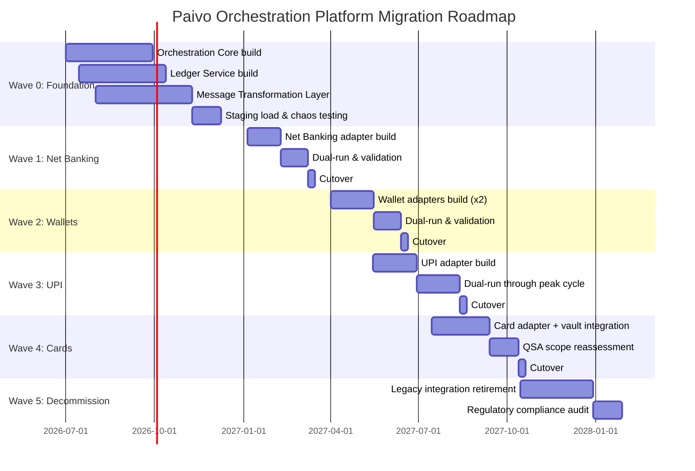

# Migration Roadmap

## Sequencing Principle

The roadmap sequences by **risk, not by sales priority** — the lowest-volume, lowest-complexity rail migrates first so that early production issues with the new orchestration platform are discovered against the smallest possible blast radius, per the resolution documented in [`01-phase-a-vision-and-scope/stakeholder-map.md`](../01-phase-a-vision-and-scope/stakeholder-map.md). An alternative sequencing — highest-volume rail first, to prove value fastest to sales and leadership — was considered and rejected: it would front-load risk onto the rail Paivo can least afford to destabilize, in exchange for a marketing benefit the ARB judged not worth the exposure.

## Wave Structure

| Wave | Timeframe | Scope | Exit Criteria |
|---|---|---|---|
| Wave 0 — Foundation | Q3 2026 – Q4 2026 | Build Orchestration Core, Ledger Service, Idempotency Store, Message Transformation Layer (no live rail traffic yet) | Core services pass load and chaos testing at Tier-0 SLA in staging; ISO 20022 schema validation passes full compatibility suite |
| Wave 1 — Lowest-Risk Rail | Q1 2027 | Migrate net banking (lowest transaction volume, single dominant PSP) as first live adapter, dual-run against legacy integration | 4 weeks of dual-run with zero ledger/legacy discrepancy beyond defined tolerance; rollback tested and proven |
| Wave 2 — Wallets | Q2 2027 | Migrate wallet rail adapters (2 PSPs) | Reconciliation discrepancy rate for migrated traffic below program target (<20/month equivalent, pro-rated) |
| Wave 3 — UPI | Q2 2027 – Q3 2027 | Migrate UPI adapter — highest transaction count, moderate value-per-transaction | Sustained Tier-0 availability through a full peak volume cycle (e.g., a high-traffic retail period) |
| Wave 4 — Cards | Q3 2027 – Q4 2027 | Migrate card rail adapter, activate full PCI-DSS scope boundary via token vault | External QSA confirms reduced PCI-DSS audit scope (≤3 systems) before legacy card integration is decommissioned |
| Wave 5 — Legacy Decommission & Hardening | Q4 2027 – Q1 2028 | Decommission remaining legacy point-to-point integrations; full ISO 20022 compliance certification | Zero live traffic remaining on legacy integrations; regulator-facing compliance audit passed |

## Roadmap Gantt

## Regulatory Deadline Alignment

The ISO 20022 message transformation layer is built and validated in Wave 0, well ahead of the regulatory deadline, specifically so that compliance is not dependent on the full multi-wave rail migration completing on time. This was a deliberate governance decision: the Head of Risk & Compliance flagged that tying regulatory compliance to the last migration wave (Wave 5, projected Q1 2028) would leave no buffer if any wave slipped, and required that the transformation layer's compliance readiness be decoupled from rail-by-rail cutover timing. In practice this means Paivo can demonstrate ISO 20022 message compliance for whichever rails have migrated by the deadline, with a committed, ARB-approved plan for the rest, rather than an all-or-nothing bet on the full program finishing on schedule.

## Cadence and Checkpoints

Each wave has a mandatory ARB go/no-go checkpoint before cutover, evaluated against the exit criteria in the table above. A wave that misses its exit criteria does not proceed to cutover on schedule by default — extending dual-run is the standing default response, with the Executive Sponsor escalation path available (per [`00-preliminary/governance-framework-setup.md`](../00-preliminary/governance-framework-setup.md)) if a merchant commitment genuinely requires an accelerated exception.

---
*Fictional case study — see [README](../README.md) for full disclaimer.*
